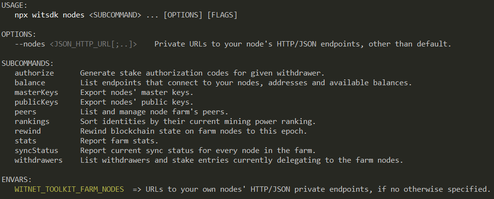
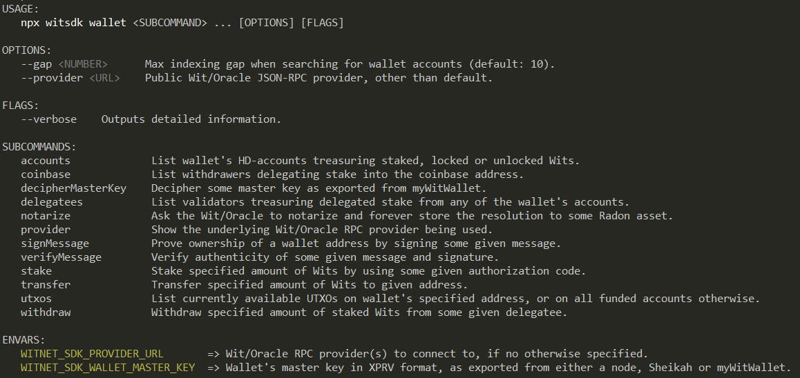
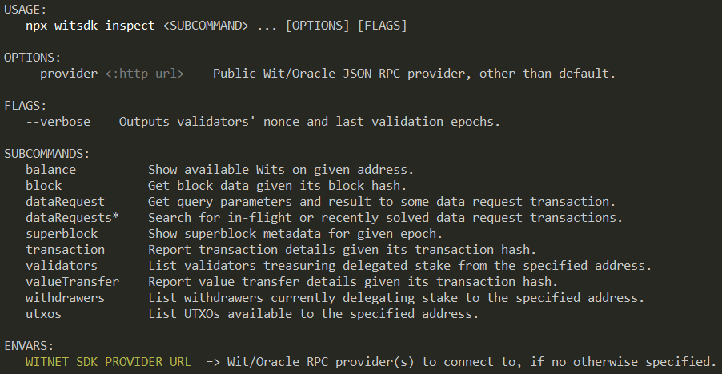
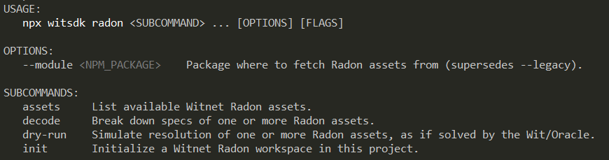

# Witnet SDK and CLI tools

> The **Witnet SDK** empowers devops and Web3 developers to seamlessly interact with the Witnet blockchain.

## ✨ Overview

Users of the Witnet SDK library or the embedded CLI tools, will be able to:

- 👛 Create HD-wallets to hold and transact with $WIT coins.
- 🌱 Stake and withdraw $WIT coins into and from Witnet validators.
- 🧮 Build oracle queries adapted to all sorts of data sources and use cases.
- 🩺 Simulate resolution of oracle queries, locally and at no cost.
- 🧑‍⚖️ Notarize resolution of oracle queries on the Witnet blockchain.
- 📰 Report resolution of oracle queries into smart contracts.
- ⛓️ Check dynamic information on the Witnet P2P network.
- 🔎 Explore public data on the Witnet blockchain.
- 🪪 Generate legit stake-authorization codes for external customers.

## 📦 Installation

### CLI as a global binary
Install the `witsdk` binary:
```bash
$ npm install -g @witnet/sdk
$ witsdk --version
```

### SDK as project dependency
- Add the @witnet/sdk package to your project:
```bash
$ npm install --save-dev @witnet/sdk`
```
- Import from Javascript:
```javascript
const { assets, utils, Witnet } = require("@witnet/sdk")`
```
- Import from Typescript:
```typescript
import { assets, utils, Witnet } from "@witnet/sdk"
```

## ⚙️ Requirements
- Node.js >= 20.
- Witnet wallet with sufficient $WIT balance.

## 🔧 Configuration
Both the CLI and the library can be configured by using a **.env** file declaring this variable:
```bash
WITNET_SDK_WALLET_MASTER_KEY="xprv_string_here_as_exported_from_a_node_mww_or_sheikah"
```

You can optionally:
- Settle your preferred WIT/RPC provider, like a Witnet node of your own, or third-party providers, by using the command-line option `--provider` (if using the CLI), or by setting the `WITNET_SDK_PROVIDER_URL` environment variable.

## 🧪 Supported Networks
| Witnet Network | Network id | WIT/RPC endpoints |
| -: | :-: | :- 
| Mainnet | `0x9fed` | https://rpc-01.witnet.io
| Testnet | `0x749f` | https://rpc-testnet.witnet.io

## 🛠️ Usage

### Library modules

> *Please, find Javascript and Typescript code snippets in the [Witnet Docs site](https://docs.witnet.io/witnet-sdk/how-to-guides).*

### CLI modules

---
#### `$ npx witsdk network`
Retrieve dynamic information from the Witnet's P2P network:


---
#### `$ npx witsdk wallet`
Self-custodian local wallet for spending and staking at will your own $WIT coins:


---
#### `$ npx witsdk inspect`
Inspect public data from the Witnet blockchain:


---
#### `$ npx witsdk radon`
- Manage pre-built Witnet-compliant data requests and templates (aka. Radon assets):


- If willing to customize Radon assets specific to your Web3 project, please initialize the **witnet/** workspace folder:
  ```bash
  $ npx witsdk radon init
  ```

---
#### `$ npx witsdk nodes`
Interact with your own private Witnet nodes, if reachable:


## 🔐 Security
- Do not share your private keys.
- Use trusted RPC endpoints when using third-party providers.
- Disable "sensitive methods" on your Witnet node if willing to publish any of its  of the RPC ports.

## Documentation
Learn more about Witnet, the $WIT coin and the Wit/Oracle framework for smart contracts at:

👉 https://docs.witnet.io 
👉 https://witnet.io
👉 https://witnet.foundation/

## 🧾 License
MIT © 2025 — Maintained by the [Witnet Project](https://github.com/witnet).

